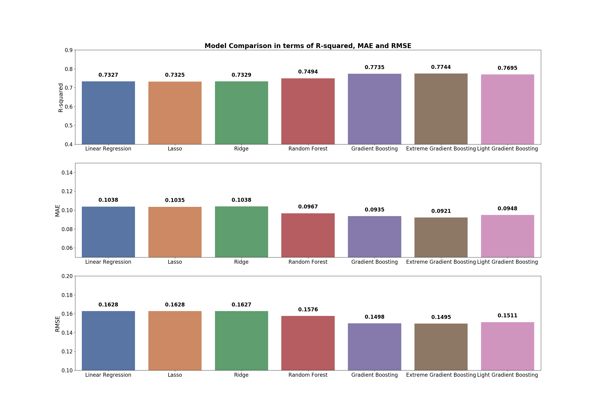

# Apartment Rental Price Predictions and Interactive Map 

## Introduction: About the Project

Thousands of new students move to Toulouse (France) every year for their studies for a total. It is often difficult for them to know which neighborhoods are the cheapest or to identify which apartments have been undervalued/overvalued based on their set of features. However, many research and tutorials have been focusing on training models to predict property selling prices, but relatively few on predicting apartment rental prices. This project aims to fill the gap and provide useful insights to people, especially students, to help them in their decision-making as to which apartment to rent out.

In summary, the aims of this project are: 
1. To build a web scraper to collect the apartment listings in Toulouse from the platform [SeLoger.com.](https://www.seloger.com/immobilier/locations/immo-toulouse-31/bien-appartement/?LISTING-LISTpg=0)
2. To build a model to estimate what should be the correct rental price given different features and their property.
3. To provide [an interactive geographic map](https://toulouse-apt-rental-price.herokuapp.com/geomap) to get more familiar with the different neighborhoods of the city and incorporating the number of overvalued and undervalued apartments per neighborhood from the predictions made previously.

## Predicting Rental Price
After the data has been scraped, it is a natural progression to explore and model the relationships between the property features and the rental prices. Seven different types of algorithms were used to train the models. We will focus on comparing the performance and results of the following seven algorithms:
1. Linear Regression
2. Lasso
3. Ridge
4. Random Forest Regressor
5. Gradient Boosting Regressor
6. Extreme Gradient Boosting Regressor
7. Light Gradient Boosting Regressor

### Metric
The metrics that we use for evaluation are R-squared, Mean Absolute Error (MAE) and Root Mean Squared Error (RMSE):
- R-squared: Measures the % of variance in the target variable explained by the data
- MAE: Average over the test sample of the absolute differences between prediction and actual observation where all individual differences have equal weight.
- RMSE: Square root of the average of squared differences between prediction and actual observation.

Both RMSE and MAE express average model prediction error in units of the variable of interest, the lower better the model, but RMSE gives a relatively high weight to large errors which means it is more useful when large errors are particularly undesirable. It is also a more popular metric in the field. However, MAE is easier to understand and interpret as it measures the average error.

To determine the best model, we need to specify what "best" means. In this case, we want to use the model to predict rental prices, it is important that the model selected is the one that minimizes prediction error, and MAE provides a more intuitive indicator of average error of the predicted values, which is easy to understand and interpret.

### Model Comparison

Based on the seven models trained, the Extreme Gradient Boosting Regressor has the highest R-squared value of 0.7744 i.e. 77.44% of the variability in rental prices can be explainedby the features collected and transformed. Extreme Gradient Boosting Regressor also has the lowest RMSE and MAE values. We will then use a Extreme Gradient Boosting Regressor to predict rental prices of listings.

### Final Results
From the ranking of [feature importances](modeling/feature_importances.png) provided by xgboost we are able to identify the top five most important features:
- The size of the appartment in squared meters ("area")
- Surprisingly the number of toilets ("toilets"), 
- If the apartment is located in the neighborhood 1.1 ("nbhd_no_1_1")
- If the apartment is furnished ("furnished")
- If the apartment has a wooden floor ("wooden_floor")

Generally, the feature importances ranking conforms to conventional wisdom on property rental prices. For example, apartments with larger "area", "furnished" and closer to the city center "nbhd_no_1_1" tend to command higher rental prices. 

Once we have predicted the rental prices we have been able to to determine: 
- The percentage of change between between the predicted rental price and the actual rental price for each apartment ("pct_change"). This gives an idea of the magnitude of the difference between predicted and actual rental prices for each listing.
- If the apartment is overvalued, fair-valued or undervalued ("category"). We create this new feature by setting a threshold at 10% using the difference in percentages created previously. Meaning that for an apartment with a predicted rental price of 1,000 € the apartment will be considered:
  - Overvalued when its actual rental price is above 1,100 € 
  - Fair-valued when its actual rental price between 900 € and 1,100 €
  - Undervalued when its actual rental price is below 900 € 
This threshold can be modified at anytime and depends of ones definition of overvalued and undervalued apartments for rent. 
This new features has for purpose to help people know for which listings there are getting the best rental prices. Based on this threshold we discover that 12% of the apartment are overvalued, 9% are undervalued.

As we can see below it seems that most overvalued but also undervalued apartments are located in the center of Toulouse. This could mean that in some sectors we are lacking some information and we might classify as overvalued a property that in fact at-value. There might be more in stake than the features we used to explain the rental price.

## Interactive Map
The interactive geographical map below provides details on Toulouse apartments for rent currently available. 
The chart breaks down the apartments for rent by:
- Median Rental Price
- Average Rental Price
- Median Area in Square Meters
- Average Area in Square Meters
- Median Rental Price per Square Meter
- Average Rental Price per Square Meter
- Number of Apartments for Rent
- Percentage of Overvalued Apartments for Rent based on the predictions made in the previous part (threshold at 10%)
- Percentage of Undervalued Apartments for Rent based on the predictions made in the previous part (threshold at 10%)

[Link to Interactive Map of Toulouse Apartments For Rent 2020](https://toulouse-apt-rental-price.herokuapp.com/geomap)

## Data: A data directory
In Toulouse, SeLoger.com is an online marketplace allowing real estate agencies and owners to post listings on their website. The website gathers most of apartments for rent of the city. The data is based on listings from SeLoger.com and is collected using a custom scraper. 
- data_seloger_raw.csv - The raw data scraped from [SeLoger.com](https://www.seloger.com/immobilier/locations/immo-toulouse-31/bien-appartement/?LISTING-LISTpg=0) for all currently available apartments for rent in Toulouse, France.
- data_seloger_clean.csv - The cleaned data after processing and cleaning steps.
- data_geomap.csv - The data use for the geo mapping part.
- recensement-population-2015-grands-quartiers-population.geojson - The mapping data downloaded from [data.toulouse-metropole.fr](https://data.toulouse-metropole.fr/explore/dataset/recensement-population-2015-grands-quartiers-population/export/)
- data_for_modeling.csv - The data used for the modeling part after feature engineering and processing

## Notebooks
There are three notebooks within this repository representing different stages of the project:
- scraper.py - Scrape the data from SeLoger.com
- data_processing.py - Prepare raw data scraped from 
- EDA.py - EDA of the cleaned data
- model.py - Build and compare several models and find the best hyper-parameters for the final model
- geomap.py - The mapping code for the interactive geographical map of Toulouse real sstate

## Heroku Files
- Procfile
- requirements.txt
- runtime.txt

## Prerequisites
Dependencies can be installed via:
pip install requirements.txt

## Possible Improvements
- Consolidate regularly the dataset by only scraping new listings that are not in the dataset yet (to reduce overfitting)
- Scrape from additional data sources. ie. Leboncoin (to reduce overfitting)
- Select other features or conduct feature engineering on existing features
- Add a widget to the interactive map to be able to select per number of rooms/bedrooms 

## Author
Jeremy Ndeby - Creator - [@jeremyndeby](https://github.com/jeremyndeby)

If you have any feedback or questions for this project, feel free to contact me via my [LinkedIn](https://www.linkedin.com/in/jeremyndeby/)
